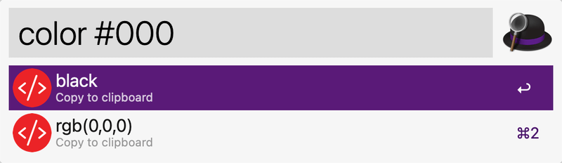
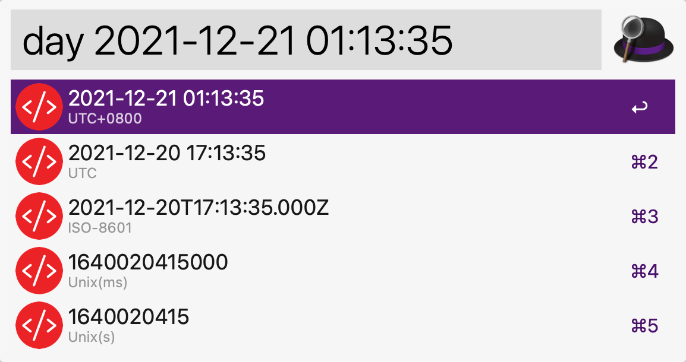
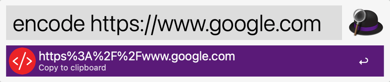
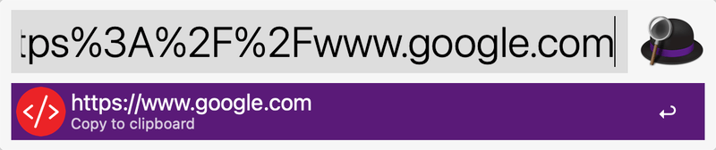
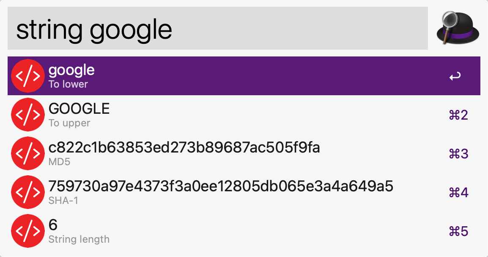
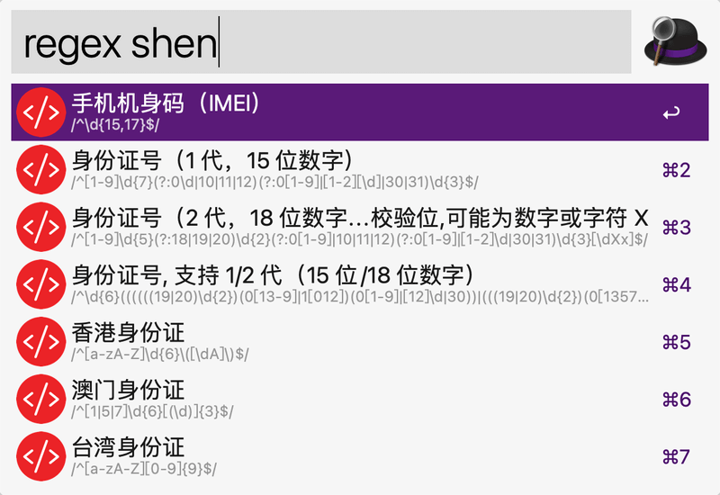

# Alfred workflow for developer

### Install

```shell
yarn global add alfred-developer
```

### Usage

In Alfred, type: `color` `day` `encode` `decode` `qrcode` `string` `uuid` `regex`

#### color



#### day



#### encode



#### decode



#### string



#### regex


